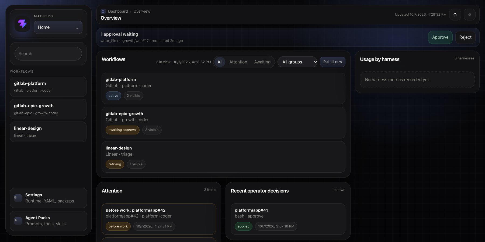

# Maestro

**Your issues, your agents, one control room.** Maestro runs Claude Code and Codex against GitLab or Linear work items from a single machine. It schedules runs, prepares and reuses workspaces, routes operator requests, and records what happened. The agent remains responsible for code changes, pull requests, and task-specific decisions.

[Get started](docs/getting-started.md) · [Configuration reference](docs/reference.md) · [Operator guide](docs/operator-guide.md) · [Security findings](FINDINGS.md)



*Dashboard shown with local demo data.*

## What you get

| | |
|---|---|
| **Bring your tracker** | Poll GitLab issues or epics and Linear issues; filter by state, labels, and assignee. |
| **Bring your agent** | Run Claude Code or Codex with reusable agent packs, prompts, and optional Docker execution. |
| **Keep control** | Set global, per-source, and per-agent concurrency; route approvals and messages through the TUI, web dashboard, or Slack. |
| **Recover cleanly** | Reuse healthy git workspaces, retry failed work with backoff, persist run state and bounded output, and inspect run history. |
| **Build workflows** | Chain sources through lifecycle labels and tracker states, such as implementation followed by review. |

```text
GitLab / Linear  →  source filter  →  workspace  →  Claude Code / Codex
                        ↑                                  │
                        └──── lifecycle + retries ←────────┘
                                      │
                              TUI · web · Slack
```

Maestro is a local orchestration daemon. A source pairs one tracker filter with one agent type. Multiple sources can run concurrently within the limits you set. Tracker labels and states determine which source receives work next.

## Try it

You need Go 1.26+, `git`, one tracker token, and the `claude` or `codex` CLI for your chosen example.

```bash
git clone https://github.com/tannerwj/maestro.git
cd maestro
make build
```

For GitLab + Claude Code, edit [`examples/gitlab-claude-auto.yaml`](examples/gitlab-claude-auto.yaml) with your project and identity. Its pack path is relative to the example file, so you can run it there:

```bash
export MAESTRO_GITLAB_TOKEN=...    # GitLab token with access to the project
export MAESTRO_USER=...            # assignee used by this example
bin/maestro doctor --config examples/gitlab-claude-auto.yaml
bin/maestro --dry-run --config examples/gitlab-claude-auto.yaml
bin/maestro --config examples/gitlab-claude-auto.yaml
```

The dry run polls once and previews eligible work, workspace choice, and lifecycle actions without launching an agent or changing Maestro state. For Linear + Codex, start with [`examples/linear-codex-auto.yaml`](examples/linear-codex-auto.yaml). More setup paths are in [Getting Started](docs/getting-started.md).

## Operate it

Run with the terminal UI by default, or add `--no-tui` for structured logs. Enable the local dashboard with `server.enabled: true`; it includes live status, run output, approvals, workflow controls, and config tools. The web/API server defaults to loopback. Non-loopback binds require an API key; put a trusted TLS proxy in front of it for remote access.

Agent processes receive a curated environment plus explicit `agent_types[].env` entries. Docker execution is optional; host-side hooks and workspace preparation have separate execution rules. Read [Agents](docs/agents.md) before relying on Docker or manual approvals as a security boundary. In particular, Claude manual approval currently resumes under `bypassPermissions` after approval, and Docker `network_policy: allowlist` can be bypassed by direct sockets. See [the findings](FINDINGS.md) for status and mitigations.

## Documentation

| Guide | Use it for |
|---|---|
| [Getting Started](docs/getting-started.md) | First GitLab or Linear setup and a first run |
| [Configuration reference](docs/reference.md) | YAML fields, agent packs, lifecycle routing, CLI, and API |
| [Agents](docs/agents.md) | Packs, harnesses, environment, Docker, and prompts |
| [Trackers](docs/trackers.md) | GitLab projects and epics, Linear, and writeback |
| [Operator Guide](docs/operator-guide.md) | TUI, dashboard, recovery, and troubleshooting |
| [Demo Walkthroughs](docs/demo-walkthroughs.md) | Guided flows for each tracker and harness |
| [Testing](TESTING.md) | Hermetic and live checks |
| [Security and performance findings](FINDINGS.md) | Review evidence and remaining risks |
| [Future Improvements](docs/future-improvements.md) | Planned and deferred capabilities |

`docs/original-spec.md` is the original design proposal, preserved for historical context; use the guides above for current behavior.

## Development

```bash
make test
make smoke-hermetic
make build
```

The smoke test uses local fake trackers and stub harnesses; it needs no credentials. Live checks and browser verification are described in [Testing](TESTING.md).

Licensed under [AGPL-3.0](LICENSE).
