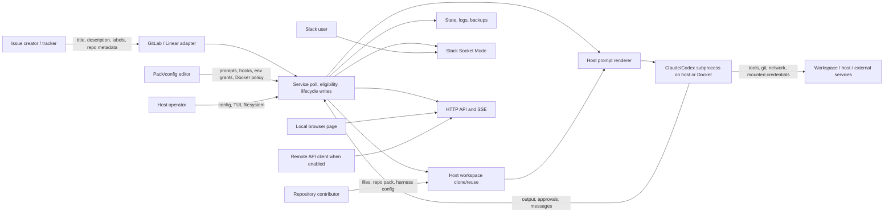

# Maestro security and performance review

**Historical baseline:** This report records the pre-remediation behavior at the revision below. The reproduction programs in `review/` now assert that the fixed paths are rejected; current status and rollback guidance are in [FINDINGS.md](../FINDINGS.md).

**Revision:** `f6a77da38e1eaabe1d27b83a6bc9039032c3d5fd` (clean checkout before review; only `review/` was added).
**Date/environment:** 2026-10-02, macOS Darwin 25.6.0 arm64, Go 1.27.1, Node 24.15.0, Python 3.14.8.
**Scope:** checked-out Go daemon, React dashboard, agent packs, build scripts, examples, and current README. No live GitLab, Linear, Slack, model, or production systems were contacted. No application code was changed.

## Executive summary

**Overall risk: high for installations that dispatch untrusted tracker or repository content with host credentials.** The strongest confirmed chains are: (1) a repository pack symlink makes the host read an out-of-workspace file into an agent prompt; (2) Claude's `manual` approval resumes by rerunning with `bypassPermissions`, widening one approval to the rest of that turn; (3) Docker `network_policy: allowlist` leaves bridge egress open to processes that ignore proxy variables. A default loopback dashboard also accepts forged-origin POSTs, and workspace identifier collisions can route a later issue into an earlier issue's clone.

**Immediate containment:** restrict `repo:` packs to trusted repositories/revisions or disable them; use Codex manual mode or keep Claude manual work in a disposable, restricted container until approval semantics are fixed; do not treat Docker allowlist mode as egress isolation; bind the API to loopback only in a browser environment you trust, or put it behind authenticated origin-aware access. Keep state/log directories private to the Maestro account.

**Top performance/reliability risks:** unbounded per-run output held in memory and copied to disk; tracker `Get` amplification for each dispatch candidate and active run; full snapshot serialization, fsync, and backup copy on each state save. SSE adds a full snapshot/marshal cycle per client per second. The current hermetic E2E smoke is broken by its fake GitLab `/links` handler, preventing an end-to-end performance baseline.

## Architecture and trust boundaries



The assets are tracker write tokens, model/CLI credentials, Git and Docker credentials, source code and uncommitted work, issue content, approval decisions, local state/logs, and the host filesystem. The issue creator controls tracker text and, subject to tracker permissions, labels/state. A repository contributor controls files read by the harness, and can control `repo:` pack prompt/context assets. A pack/config editor controls explicit environment values, mounts, hook scripts, harness arguments, and approval policy. The host operator can control everything. Slack users and API clients can issue control-plane actions only if their channel/API authorization permits it; a local browser page can reach loopback over HTTP.

| Integration | Credentials and data exchanged | Authority granted |
|---|---|---|
| GitLab / Linear | Tracker token, issue text/labels/state, comments, lifecycle writes | Read selected issues, mutate labels/state, post operational comments; token scope is external configuration. |
| Git clone/fetch | Host Git credential helper and matching GitLab token via `http.extraHeader`; repository files | Read/modify the selected checkout; origin and branch are local workspace state. |
| Claude/Codex host process | Curated baseline environment plus explicit agent env; local CLI auth/home may still be reachable | Commands, files, and network under the Maestro OS account, subject to harness policy. |
| Docker harness | Explicit env/auth mounts, workspace bind, optional caches; Docker daemon credentials stay with host-side client | In-container commands; bind-mounted workspace and configured mounts; network per Docker configuration. |
| Slack Socket Mode | App/bot tokens; run summaries, approval/tool input, control replies | Approved Slack users can resolve requests or stop runs. |
| Web/API/SSE | Optional bearer key; snapshots, run tails, raw config/backups, control actions | Read sensitive state and write config/packs, poll, approve/reject, reply, stop. Loopback default is unauthenticated. |
| Local state/logs | Issue metadata, approval history, raw agent output | Restart recovery and local forensic record; file access depends on OS modes. |

**Guaranteed by Maestro:** tracker candidate refresh before dispatch; exact reserved lifecycle label filtering; curated host child environment; source-scoped runtime state in multi-source mode; per-source, agent, and global dispatch limiters; bounded dashboard output tails and event/history counts; Slack authorized-user check; non-loopback API key generation; Docker default hardening flags. **Dependent on configuration/external harness:** OS account reach, tracker token scopes, host Git credential helpers, actual model sandbox enforcement, Docker daemon network/firewall, mounted secrets, source/repository trust, and whether the harness obeys prompt instructions. Prompt text is guidance, not an enforcement boundary.

## Confirmed security findings, ordered by severity

### S1. Repository pack symlink reads host files outside the workspace — High, high confidence

**Prerequisites:** `agent_pack: repo:` is enabled for a repository on which an attacker can land a symlink, and the target file is readable by Maestro's host account. **Path:** `run_manager.go:332` calls `ResolveRepoPack`; `agent_packs.go:332-355` uses `os.Stat` on the pack directory, following a symlink; `agent_packs.go:113-116` checks `prompt.md` the same way; `prompt/render.go:74-82` reads it on the host before the harness starts. A contributor can commit `.maestro` as a symlink to a known readable host directory. The file then becomes prompt content sent to the agent/model, including for Docker harnesses because rendering is host-side. **Evidence:** `go run ./review/repro_repo_pack_symlink` returned `outside_file_loaded=true` using an isolated file. **Controls:** repo pack paths reject lexical `..`/absolute paths; context traversal and pack config directory copying reject some symlinks. Those checks do not reject the root pack symlink. **Fix:** resolve and validate every pack asset with `Lstat`/`EvalSymlinks` and a canonical workspace root; reject symlinks or open with no-follow semantics. Pin the trusted pack revision. **Validation:** end-to-end local bare repo containing `.maestro` symlink must fail before prompt rendering; ordinary repo pack still works. Rollback: disable `repo:` for affected agents.

### S2. Claude `manual` approval becomes a whole-turn bypass — High, high confidence

**Prerequisites:** Claude Code agent with `approval_policy: manual`, untrusted issue/repository content capable of influencing tool selection, and an operator approving one denied action. **Path:** `claude/adapter.go:346-372` first runs with `--permission-mode default`, records the *first* denial (`:453-456`), then on approval reruns the prompt with `--permission-mode bypassPermissions`; `:375-393` appends extra args after the mode. Maestro's approval record contains tool name/input (`orchestrator/approvals.go:64-92`), but approval does not bind to a particular subsequent invocation. The rerun can choose a different command or more commands without another Maestro approval. This is an authority gap even if the agent is well-behaved most of the time. **Evidence:** direct control-flow trace and existing stub approval flow in `claude/adapter_test.go:178-253`; no live model behavior tested. **Controls:** the first pass uses Claude's default permissions; rejection stops the run. **Fix:** use a harness-native per-tool approval channel that resumes the exact denied call, or stop after denial and require a new constrained turn without bypass mode. Reject unsafe extra args when manual policy is intended to enforce it. **Validation:** stub harness emits two denied actions, approve only the first, and assert the second never executes without a second approval; run the real hermetic smoke once fixed. Rollback: disable Claude manual dispatch or constrain it to a disposable container with narrow mounts/network.

### S3. Docker allowlist is bypassable through direct bridge networking — High, high confidence in configuration; container proof unavailable

**Prerequisites:** Docker harness with `network_policy.mode: allowlist`, code execution inside the container, and Docker bridge network with its normal outbound routing. **Path:** `process_runner.go:537-554` sets `HTTP_PROXY`/`HTTPS_PROXY`/`ALL_PROXY` but returns `--network bridge`; it adds no egress firewall or transparent interception. An agent can run a client with proxy variables removed or use a direct socket. Its process can also reach other services on the default bridge or host gateway depending on daemon setup. The proxy itself checks allowed hostnames (`docker_allowlist_proxy.go:129-170,261-279`) only for traffic sent to it. [Docker documents bridge outbound masquerading and same-bridge access](https://docs.docker.com/engine/network/drivers/bridge/). **Evidence:** code path plus primary Docker documentation; `docker info` failed because this host has no running daemon, so direct-container execution was not measured. **Controls:** the authenticated proxy enforces its list for cooperating HTTP clients; default Docker security preset drops capabilities and sets a read-only root filesystem. **Fix:** enforce egress at the network namespace/daemon firewall layer, or use an internal network with a dedicated proxy gateway and no direct route, then test direct TCP/UDP/DNS denial. Until then, rename/document this as proxy policy, not an egress boundary. **Validation:** disposable local container + two local listeners, one allowed and one denied; compare proxied HTTP, `env -u HTTP_PROXY -u HTTPS_PROXY curl`, and raw socket attempts. Rollback: `network_policy: none` for offline jobs or host firewall control for networked jobs.

### S4. Loopback API accepts cross-origin state-changing form POSTs — Medium, high confidence in server behavior

**Prerequisites:** default unauthenticated loopback server and a local operator opening an attacker-controlled page. **Path:** `api/server.go:429-467` bypasses auth when API key is empty; the middleware never checks `Origin` or `Sec-Fetch-Site`. Bodyless `POST /api/v1/poll`, approval/reject, stop, and backup actions are form-submittable (`:1053-1075,:1110-1151,:1203-1236`). A page can send the request even if CORS prevents reading its response; [MDN describes form submissions as a CSRF route](https://developer.mozilla.org/en-US/docs/Web/HTTP/Guides/CORS). **Evidence:** against local `demo-web`, `curl -X POST -H 'Origin: https://attacker.invalid' -H 'Content-Type: application/x-www-form-urlencoded' http://127.0.0.1:8769/api/v1/poll` returned HTTP 200 and `status: queued`. Actual browser behavior was not separately exercised. **Controls:** non-loopback binds get an API key; JSON-body config/pack writes require a request body, making a simple cross-site form insufficient for those endpoints. **Fix:** reject unsafe cross-origin requests using Origin/Fetch Metadata, require a CSRF token for browser writes, and consider loopback auth. **Validation:** browser E2E page on a second localhost port attempts poll/approval/stop; request must be rejected while same-origin dashboard actions work. Rollback: set a key and avoid exposing the dashboard to untrusted browser content.

### S5. Workspace key collisions reuse the wrong Git origin — Medium, high confidence

**Prerequisites:** two source issues with identifiers that normalize to the same `WorkspaceKey`, a shared workspace root, and a healthy first clone. **Path:** `workspace/manager.go:184-212` replaces every non-alphanumeric punctuation with `_` and derives the path only from the identifier; `:56-67` reuses any healthy Git repo before using the new issue's `repo_url`; `:118-123` fetches existing `origin` without comparing it to the requested URL. A later issue may run in another repository, see prior uncommitted data/harness config, and write to the wrong remote. **Evidence:** `go run ./review/repro_workspace` with `team/repo#1` and `team_repo#1` returned `same_workspace=true requested_second_origin=false actual_first_origin=true`. **Controls:** per-source active claims and runtime state; they do not namespace the workspace path. **Fix:** key by stable source ID + issue ID (or cryptographic digest) and verify canonical origin on reuse; reject mismatch rather than silently recloning over local work. Lock workspace paths across concurrent sources. **Validation:** two local bare repos with colliding identifiers, sequential and concurrent dispatch; assert distinct paths or explicit mismatch error. Rollback: separate `workspace.root` per source and clear only confirmed stale collision paths after preserving work.

### S6. Raw agent output is unbounded and saved with broad file modes — Medium, high confidence

**Prerequisites:** a noisy run or a run/tool that prints sensitive data; for local disclosure, another OS account must read the state directory. **Path:** `run_manager.go:189-201` holds all stdout/stderr in two `bytes.Buffer`s; on failure `:251-258` converts both full buffers to strings and includes them in an error; `activity.go:101-119` writes raw logs to `0o644`; `state/store.go:327-343` writes backup snapshots at `0o644`. Dashboard tails are bounded to 4096 bytes (`activity.go:12,53-62`) but raw output can still enter the API and disk, and regex redaction (`redact/redact.go:5-23`) is not applied to saved log files. A 1 GiB stream costs at least 1 GiB of retained bytes per run, with transient extra copies on failure. **Evidence:** direct trace; high-volume run not executed because the E2E smoke failed before dispatch. **Controls:** run concurrency limits, process timeout/stall logic, bounded dashboard tails, selected event redaction, `CreateTemp` state file mode 0600. **Fix:** stream to size-bounded rotating files with 0600 mode, maintain only a bounded tail in RAM, redact at intended exposure boundaries, and cap error summaries. **Validation:** isolated stub emits 100 MiB; assert bounded RSS and disk, no raw fixture secret in dashboard/state, exact file permissions. Rollback: lower concurrency/output volume and restrict state directory to 0700.

### S7. API key transport and raw config exposure need deployment hardening — Medium, high confidence, non-default exposure

**Prerequisites:** non-loopback HTTP bind or an enabled API key used through the browser. **Path:** `api/server.go:455-465` accepts `api_key` on any API route; `web/src/api.ts:84-85` puts it in the SSE query string because EventSource cannot set bearer headers. `api/server.go:682-701` returns raw config, and `:941-985` returns raw backups to any API-key holder. The HTTP server starts without TLS (`api/server.go:399-403,469-480`), and an ephemeral key is explicitly written to the application log (`:404-405`). Query keys can enter HTTP access logs, browser diagnostics, and reverse proxy logs; plaintext HTTP exposes them on untrusted networks. The key grants full read/write control-plane authority, not a view-only role. **Evidence:** direct code path; no network capture performed. **Controls:** key is random when non-loopback and absent from URL after dashboard bootstrap (`web/src/api.ts:26-33`); bearer header used for normal fetches. **Fix:** TLS via a trusted reverse proxy, origin-aware auth, short-lived SSE ticket/cookie instead of a long-lived query key, split read/write roles, and avoid returning raw secret-bearing config to ordinary viewers. Provide ephemeral credentials through a protected operator channel instead of normal logs. **Validation:** reverse-proxy and application access logs with a fixture key contain no credential; viewer key cannot mutate config/approve. Rollback: bind only to loopback and rotate keys after exposure.

## Hypotheses, operational conditions, and documentation gaps

- **Cross-instance duplicate claims (medium confidence):** `loop.go:29-51` refreshes eligibility, and `run_manager.go:62-71` claims only in process memory before best-effort lifecycle writes. Two Maestro processes pointed at the same source can both pass the refresh before either label lands. A two-process local fake-tracker race test is needed. Single-instance source/global limiters and route diagnostics mitigate the intended deployment.
- **Stateless Docker reuse may preserve artifacts outside its reset paths:** `process_runner.go:360-369` resets `/tmp/maestro-runs`, while a matching-profile shared container/home/cache can survive across runs. Profile/lineage keys and default `reuse:none` are controls. A daemon-backed local fixture should check HOME, cache, process, and mount persistence across two issues. No daemon was available here.
- **Approval display precision:** Codex `item/permissions/requestApproval` stores only the reason in `ToolInput` (`codex/adapter.go:924-934`) while the exact permissions map is returned upon approval. An operator might approve a vague reason without seeing the requested permission set. Harness RPC semantics should be checked with current primary Codex documentation and a local stub before assigning exploit severity.
- **Documentation drift:** the built-in `agents/dev-{claude,codex}/prompt.md:31-36` says the orchestrator owns all lifecycle transitions and instructs agents to push PRs, while the current architecture says agents own task progress and the user-provided project instructions say Maestro routes lifecycle labels. Align these prompts with the actual contract so agents do not infer incorrect authority. README accurately calls the Docker allowlist an HTTP/HTTPS proxy control (`README.md:307-311`), but the heading “egress control” can still be read as full isolation.
- **Supply chain:** `go mod verify` passed for 26 modules. `npm audit --offline --json` reported zero known vulnerabilities from the local cache; an offline result does not establish current advisory coverage. No version-only alert is asserted. Image pinning is optional by default (`config/types.go:892-899`); require digests for Docker deployments. Release script and embedded frontend path were inspected, but release signing/provenance was not exercised.

## Performance and reliability results

All measurements are local fixture results, **not production estimates**. Cold compilation, the broken smoke, tracker network latency, model time, Docker startup, and Git fetch cost are outside these numbers.

| Scenario and command | Raw result | Explanation |
|---|---|---|
| `go run ./review/bench_tracker`: 1 GitLab source, 100 issues, 20 polls | 21 HTTP calls total (1.1/tick including cold project lookup); p50 0.19 ms, p95 0.47 ms | Adapter poll only, one issue page after first lookup. |
| Same, 1 source, 1,000 issues | 201 calls (10.1/tick); p50 1.94 ms, p95 2.17 ms | Ten 100-item pages. |
| Same, 10 concurrent sources × 100 issues | 210 calls (10.5/tick); p50 1.61 ms, p95 1.85 ms | Ten independent adapter polls in parallel. |
| Same, 10 sources × 100 issues, fake server sleeps 100 ms/request, 5 polls | 60 calls (12/tick including lookup); p50 102.55 ms, p95 203.47 ms | Initial lookup plus page causes cold tick about 200 ms; steady polls about 100 ms. |
| `go run ./review/bench_state`: 100 / 1,000 / 10,000 finished entries, 20 saves each | JSON 31,359 / 313,059 / 3,130,059 bytes; p50 4.011 / 4.871 / 13.218 ms; p95 5.270 / 5.146 / 14.902 ms | Full marshal, fsync, and full backup copy on each save. Two backups can occupy roughly 3× snapshot size before logs. |
| 200 sequential local `demo-web` GETs to `/api/v1/status`, `/runs`, `/config/raw` | Status 20,838 B, p50/p95 0.190/0.307 ms; runs 5,434 B, 0.126/0.207 ms; config raw 8,024 B, 0.155/0.270 ms | Tiny built-in demo, no network or realistic large snapshot. Exact Python loop is in the coverage section. |
| `/usr/bin/time -l go test ./...` | All packages passed; 15.53 s wall; 198,148,096 B max resident set for the timed command process | Test/build metric, not daemon peak RSS. |
| `/usr/bin/time -l make smoke-hermetic` | Timed out at 180.84 s; fake tracker raises `ValueError: invalid literal for int() with base 10: '102/links'` | E2E baseline unavailable; repeated one-second polls and failed guard refreshes were observed. |

### Bottlenecks and expected improvements

1. **Tracker amplification.** Each GitLab project poll uses `ceil(all matching page results/100)` requests after a cold project lookup (`gitlab/adapter.go:174-213`). Each dispatch guard adds issue GET + links GET (`dispatch_guard.go:29-51`, `gitlab/adapter.go:328-349`), plus refresh after lifecycle writes (`run_manager.go:71-72`). Epic mode adds epic pages + group issue pages, and an epic candidate GET adds issue + epic + links. Linear polls paginate and `Get` fetches one issue including 50 inverse relations (`linear/adapter.go:280-317,392-405`). The 30 s poll context (`loop.go:12,80-85`) bounds a tick's initial Poll; later GETs use the outer context. Rate-limit headers are recorded but no retry/backoff is applied in clients (`gitlab/client.go:63-99`, `linear/client.go:42-86`). Filter and cache safe tracker data, cap candidate refreshes per tick, and honor 429/Retry-After. Expected gain: approximately two GitLab requests avoided per skipped candidate if current issue/link state can be safely cached; actual correctness and rate-limit savings need E2E validation. One slow source runs in its own service goroutine, but shared CPU, disk, limiter and API snapshots remain coupled.
2. **Output growth.** The full stdout/stderr buffers grow linearly with bytes emitted (`run_manager.go:189-201`) and logs are written at completion; failures cause full string copies. Replace with bounded tails plus streamed rotating logs. Expected gain: RAM changes from O(total output) to O(tail size + I/O buffer) per run, and disk can be bounded by retention. Verify with noisy stub.
3. **State saves and backup copies.** `state/store.go:215-277,293-343` serializes all finished/retry/history state and copies the preceding file on every save. At 10,000 finished entries the fixture measured 3.13 MB and p95 14.9 ms/save, with further growth proportional to issue history. Incremental/journaled persistence or debounced saves would reduce write amplification; retain crash consistency and test interrupted writes before switching. The current full backup offers useful recovery, so roll back to it if recovery validation fails.
4. **SSE/dashboard work.** Every connected SSE client calls `Snapshot()`, marshals a stable snapshot, then marshals the payload every second (`api/server.go:601-659`); multi-source Snapshot walks each service (`supervisor.go:94-104`). The React dashboard fetches nine collections at startup and repeatedly filters runs per approval in render (`web/src/api.ts:59-80`, `web/src/App.tsx:210-265`). Publish one versioned immutable snapshot per update and share it among clients; memoize dashboard indexes by run ID. Expected benefit grows with client count and snapshot size; no large-snapshot SSE benchmark was run, so no numeric gain is claimed.
5. **Workspace fetch/recheck cost.** Every healthy reuse fetches origin then checks out a branch (`workspace/manager.go:56-67,118-123`) even when only a local continuation is needed. Avoiding unnecessary fetches could reduce remote calls, but first fix origin validation and define freshness requirements; never trade away correctness for speed.

CPU, daemon peak RSS/heap, allocation count, goroutine/file-descriptor growth, output disk growth, and p50/p95 **full-cycle** latency were not measured. The broken E2E fixture and unavailable Docker daemon prevent presenting those as baseline results. The next safe measurement run should repair the fake `/links` route in a disposable copy, preserve its fixture sizes, then collect `pprof`, process RSS/FD, state/log byte counts, and per-tick timestamps for 1/10 sources, 100/1,000 issues, 1/5 active runs, 100 ms/429 tracker responses, and 100 MiB agent output.

## Remediation order and rollback

| Stage | Action | Tradeoff / rollback |
|---|---|---|
| Contain now | Disable untrusted `repo:` packs; isolate Claude manual agents; use `network:none` or external firewall for jobs requiring actual egress control; set private state permissions; keep API loopback with a key or trusted reverse proxy. | Reduced flexibility and model/network access; restore individual grants only after validation. |
| Near-term | Reject pack symlinks and validate canonical origin/workspace key; fix Claude approval to exact action; add Origin/CSRF protection; stream bounded logs at 0600; fix fake tracker `/links` route. | Some existing pack layouts/workspace paths need migration; preserve old workspaces before remapping and offer explicit migration/rollback. |
| Architecture | Per-source/issue workspace identity, durable tracker claim/lease for multi-instance use, network isolation independent of proxy env, state journal or database, shared versioned SSE snapshot, rate-limit-aware tracker scheduling. | Higher operational complexity; stage behind flags, compare E2E recovery and performance, keep old state format readable during rollback. |

## Coverage ledger and disproved suspicions

**Reviewed:** config/pack resolution and validation, prompt rendering, GitLab/Linear clients and adapters, service loop/dispatch/recovery/limiter, workspace/git, Claude/Codex adapters, Docker runner/proxy/reuse, hooks, state/logging/redaction, Slack actions, HTTP API/SSE, web fetch/render, README/examples, release scripts and dependency manifests. **Executed:** `go test ./...` (pass); `go mod verify` (pass); offline npm audit (zero cached alerts); local demo API Origin probe; adapter/state benchmarks; two isolated security reproductions; hermetic smoke (fail after 180 s due fake tracker); Docker daemon check (unavailable). Daybreak and Codex Security repository scan capabilities were not provisioned; `govulncheck` was not installed. No live integration tests, Docker container POC, network capture, browser E2E CSRF, large-output E2E, or production load test ran.

**Disproved or narrowed:** the host harness does not inherit the entire parent environment (`harness/env.go:8-72`); default Docker security preset is hardened (`config/types.go:998-1023`); GitLab and Linear clients use request timeouts (`gitlab/client.go:34-38`, `linear/client.go:35-39`); per-service event and approval/message histories are bounded (`orchestrator/service.go:27-29`, `approvals.go:271-276`, `messages.go:252-255`); Slack checks configured user IDs before actions (`channel/bridge.go:569-575,1096-1114`); API requires a key for non-loopback binds (`api/server.go:429-467`); repository pack lexical traversal is rejected (`config/agent_packs.go:332-346`), though symlink traversal remains; Docker's proxy rejects disallowed hosts for traffic that actually reaches it (`docker_allowlist_proxy.go:129-170`).

### Exact local reproduction commands

```bash
cd /Users/tjohnson/repos/maestro
git rev-parse HEAD
go test ./...
go mod verify
go run ./review/repro_repo_pack_symlink
go run ./review/repro_workspace
go run ./review/bench_tracker
go run ./review/bench_state
make smoke-hermetic
```

For the API probe, build `go build -o /tmp/maestro-review ./cmd/maestro`, start `/tmp/maestro-review demo-web --host 127.0.0.1 --port 8769`, then run `curl -sS -X POST -H 'Origin: https://attacker.invalid' -H 'Content-Type: application/x-www-form-urlencoded' http://127.0.0.1:8769/api/v1/poll`. For API latency, the 200-request loop used Python `urllib.request.urlopen` and `time.perf_counter` sequentially for `/api/v1/status`, `/api/v1/runs`, and `/api/v1/config/raw`; p50 is the median and p95 is sorted sample 190 of 200. Stop the demo server after probing. All examples use synthetic content and local endpoints.
